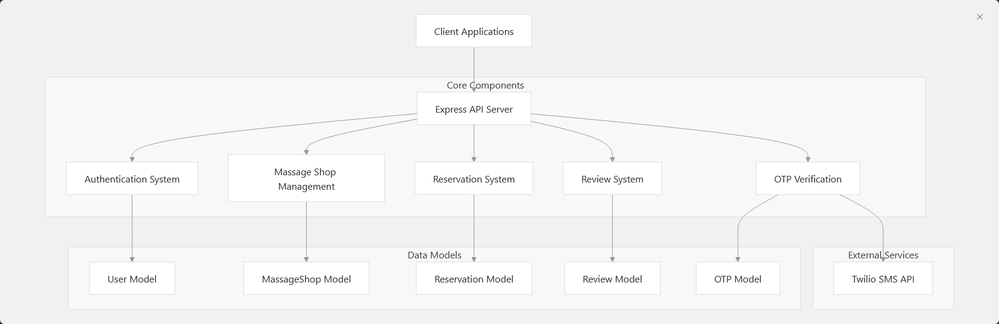
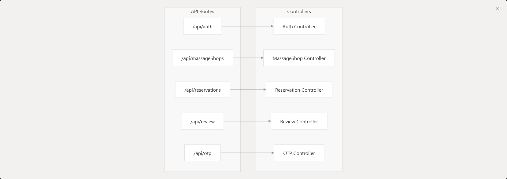
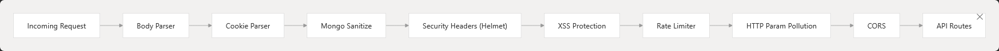
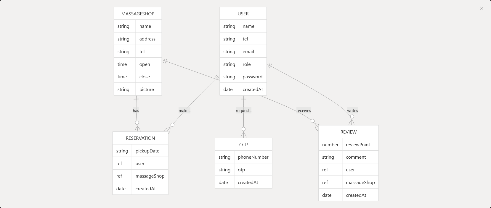

# Massage Shop Backend

Massage Shop Reservation System, a Node.js application built with Express that enables users to browse massage shops, make reservations, and leave reviews. The system implements secure user authentication with phone verification through One-Time Passwords (OTP).

Frontend repository: [MonkeyMassage-Frontend](https://github.com/WebBacillus/MonkeyMassage-Frontend)

Live Demo: [MonkeyMassage-Vercel](https://swdevprac2-project-kalaeksi-phloeng-rachan.vercel.app/)

## System Purpose

The Massage Shop Reservation System is designed to provide a secure and efficient platform for:

- User registration and authentication with OTP verification
- Massage shop listing and management
- Appointment scheduling and reservation management
- Customer reviews and ratings

## Core Components

The system consists of five primary components that work together to deliver the application functionality:

## API Routes and Controllers

The system exposes several RESTful API endpoints, each mapped to a specific controller that handles the business logic:

## Technology Stack

The system is built using the following key technologies:

|Category|Technologies|
|---|---|
|Backend Framework|Node.js, Express.js|
|Database|MongoDB with Mongoose|
|Authentication|JWT (JSON Web Tokens)|
|Security|bcryptjs, helmet, express-mongo-sanitize, express-xss-sanitizer, express-rate-limit, hpp|
|SMS Service|Twilio|
|API Documentation|Swagger UI, Swagger JSDoc|

## Security Features

The system implements multiple layers of security:

Key security features include:

- Data sanitization to prevent NoSQL injection attacks
- Security headers using Helmet
- XSS protection using express-xss-sanitizer
- Rate limiting to prevent brute force attacks
- Prevention of HTTP parameter pollution
- CORS configuration for cross-origin requests
- Phone verification using OTP

## Data Models

The system uses five primary data models that relate to each other:

## Typical User Flow

1. **User Registration**: New users register with name, email, phone number, and password
2. **OTP Verification**: Users verify their phone number using OTP sent via SMS
3. **Browse Massage Shops**: Users can view available massage shops
4. **Make Reservation**: Authenticated users can book appointments
5. **Review Service**: After the service, users can leave reviews and ratings

For more information about this repository, please 